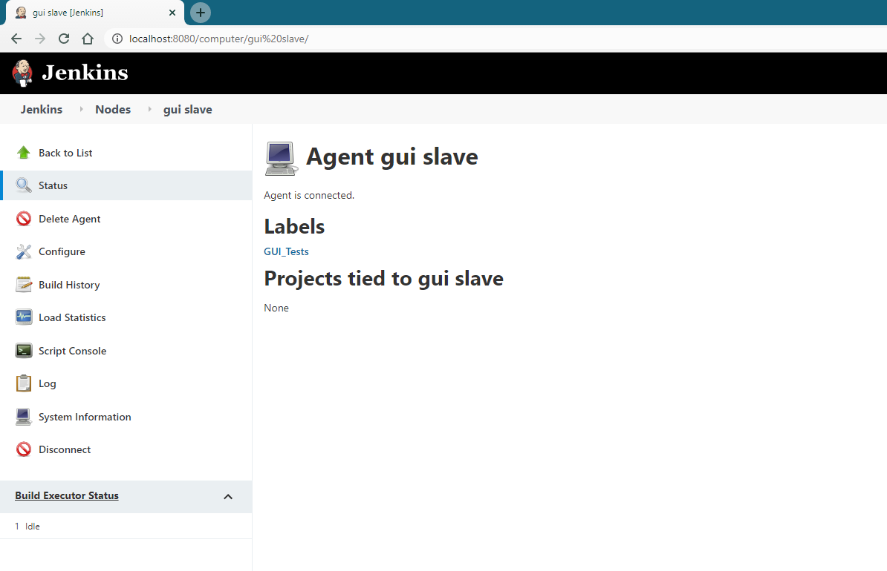
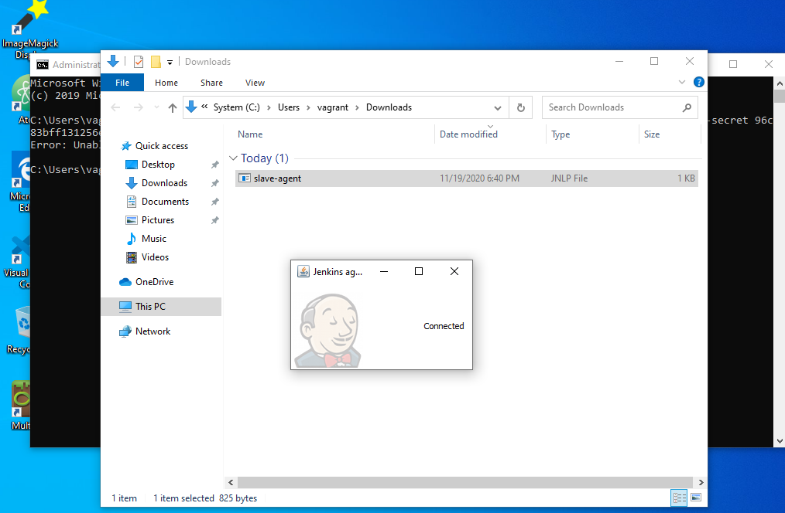
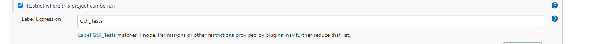

# Notes about pyautogui MultiMC Testing

- Use AWS/Jenkins VM/Bare metal Jenkins and poll main branch to see if modpack would work
- VM with VBox Guest Additions and DirectX support for OpenGL...
    - No OpenGL. This means no main menu. But, forge loading screen shows.
    - I can ditch the check for main menu IF it's detected that a VM is being used...
    - Then look for a black screen,
    - Then look for the string `Forge Mod Loader has successfully loaded (...) mods` in `C:\tools\MultiMC\instances\<NAME>\minecraft\logs\latest.txt`
    - Then loading is done for non-GPU instances.
    - Also, save the log in Jenkins.

- AWS pricing for GPU is garbage, cheaper to buy another PC
- Azure pricing for GPU is garbage, cheaper to buy another PC

## VirtualBox Jenkins Modpack CI/CT Notes

- You don't need a GPU. Minecraft will start black. The script takes this into account.
- 2 Processors
- 5120MB RAM
- 256MB of VRAM
- No 3D Acceleration
- VBoxSVGA Graphics Controller
- Give Minecraft ~4GB RAM
- You must log into MultiMC.
- Disable VBox Guest Addition mouse integrations.
- SET PIPENV_SKIP_LOCK env var to True

### But Jenkins runs as a service! It doesn't have a display!

That's right. You need to turn a Windows User who's logged on into a slave that Jenkins uses to build.

<!-- - You must enable the service Jenkins to log on as a user (`services.msc`). This allows it to open GUI programs. -->
    - <https://github.com/winsw/winsw/blob/master/doc/xmlConfigFile.md#interactive>
    - https://github.com/jenkinsci/jenkins/blob/master/core/src/main/resources/windows-service/jenkins.xml#L45
    - https://interworks.com.mk/jenkins-setup-for-executing-windows-forms-automated-tests/
    - https://exceptionshub.com/jenkins-selenium-gui-tests-are-not-visible-on-windows.html

Jenkins View:

Slave View:

Tag the build and the slave too:

## Setup Commands

    Set-ExecutionPolicy Bypass -Scope Process -Force; [System.Net.ServicePointManager]::SecurityProtocol = [System.Net.ServicePointManager]::SecurityProtocol -bor 3072; iex ((New-Object System.Net.WebClient).DownloadString('https://chocolatey.org/install.ps1'))

    choco install git jre8 golang jenkins multimc python3 microsoft-visual-cpp-build-tools

    git clone https://github.com/comp500/packwiz
    git clone https://github.com/HenryFBP/rivers-of-iron-mc

    cd packwiz
    go build
    go install .
    cd ..

    pip install pipenv
    cd rivers-of-iron-mc
    pipenv install

## Build Commands

If any of these exit other than exit code 0, or take >30 minutes, fail the build.

Poll SCM every 30 minutes.

    git clone https://github.com/HenryFBP/rivers-of-iron-mc
    cd rivers-of-iron-mc
    pipenv install
    python scripts/pyautogui/test-with-pyautogui.py